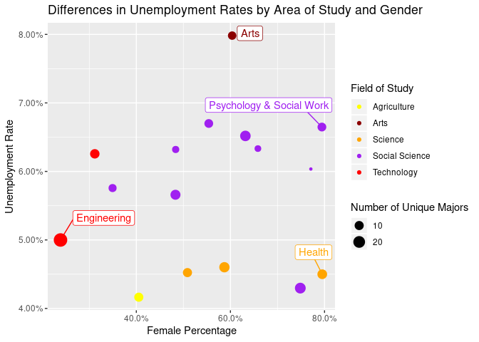

INTRODUCTION
============

These days higher education institutions are offering more majors and
degrees than ever, even St. Olaf offers 45 unique majors. With the great
diversity in careers that these majors offer, you can’t help but wonder
what their return on investment is and we plan to answer that in this
project. We are soon to be college graduates so we will examine things
like income and unemployment in our own majors and also in other
prominent majors.

Does Popularity Coincide with Earnings for an Area of Study?
===============================================================

    ggplot(data = mostpopularcount, aes(x = fct_reorder(Major_category, Count, .desc = TRUE), y = Count, fill = Major_category)) + 
      geom_bar(stat = "identity") + 
      theme(axis.text.x = element_text(angle = 60, hjust = 1), legend.position = "none") + 
      labs(title = "Popular Major Categories", x = "Major Category") +
      scale_color_manual(values = c("Business" = "blue"))

    # Out of the 25 most popular majors, Business has the most majors with 5, followed by Engineering, Liberal Arts, and Social Science. Overall, business and its' related majors are the most popular with the most cases.

    ggplot(data = categories, aes(x = fct_reorder(Major_category, mean_income, .desc = TRUE), y = mean_income, fill = Major_category)) + 
      geom_bar(stat = "identity") + 
      theme(axis.text.x = element_text(angle = 60, hjust = 1), legend.position = "none") + 
      labs(title = "Income per Major Category", x = "Major Category", y = "Median Income")

    # These are the average median incomes for each major category in our dataset. The average median income amongst the majors categorized as Engineering earn much more than the rest of the categories. Even though Business is the most popular major category it is only the fourth highest earning major category. In contrast, the physical sciences come second to last in popularity, but are ranked third in earnings. Based on this, the popularity of an area of study may not indicate increased potential for earnings.

Do Male or Female Dominated Majors Enjoy More Economic Success?
===============================================================

    ggplot(data = categories, aes(x = fct_reorder(Major_category, mean_female, .desc = TRUE), y = mean_female, fill = Major_category)) + geom_bar(stat = "identity") + theme(axis.text.x = element_text(angle = 60, hjust = 1), legend.position = "none") + labs(title = "% Female by Major Category", x = "Major Category", y = "% Female")

    #Majors low in popularity among both men and women are likely to be more female dominated. This is apparent in the case of Health and Social Work falling tenth and sixteenth in popularity for men and women, but being the two most popular majors among women.

    ggplot(recentgrads, aes(recent_ShareWomen, recent_median)) +
      geom_jitter(aes(size = recent_college_jobs, alpha = 0.2)) +
      geom_smooth(method = lm) +
      labs(
      title = "Median Income by Share of Women for each College Major",
      x = "Female Proportion",
      y = "Median Income",
      size = "Jobs Requiring a Bachelor's Degree"
      ) +
      ggrepel::geom_label_repel(aes(label = Major, hjust = -.2, vjust = -7),
      data = outliers1, show.legend = FALSE) +
      scale_alpha(guide = 'none')

    #Median Income for a particular undergraduate major tends to decrease as the proportion of women in the major increases. 

    ggplot(categories1, aes(mean_female, mean_unemployment)) +
      geom_point(aes(size = Count, color = Category)) +
      scale_color_manual(labels = c("Agriculture", "Arts", "Science", "Social Science", "Technology"), values = c("yellow", "darkred", "orange", "purple", "red")) +
      ggrepel::geom_label_repel(aes(label = Major_category, colour = Category, hjust = -.2, vjust = -1),
      data = outliers, show.legend = FALSE) +
      labs(
        title = "Differences in Unemployment Rates by Area of Study and Gender",
        x = "Female Percentage",
        y = "Unemployment Rate",
        size = "Number of Unique Majors",
        color = "Field of Study"
      ) +
        scale_y_continuous(labels=percent) +
        scale_x_continuous(labels=percent)

    #Agriculture and the sciences have the most reliably low unemployment rates. In the social sciences, the unemployment rate for each major category increases as the percentage of women in the major category increases. The arts are majority female and have the highest rates of unemployment. The low unemployment rate in the health sector may be due to the high demand for nursing majors seen in the previous plot.

\#Is a Graduate Degree Worth It?

    ggplot(data = ourmajors, aes(x = fct_reorder(Major, Nongrad_median, .desc = TRUE), y = Nongrad_median, fill = Major_code)) + geom_bar(stat = "identity") + theme(axis.text.x = element_text(angle = 60, hjust = 1), legend.position="none") + labs(title = "Median Income of Non-Graduate Workers", x = "Major", y = "Median Income")

    ## When looking at people that only have an undergraduate degree, the majors remain in the same order of median income, seen in the second plot, with lower incomes than graduates. 

    ggplot(data = ourmajors, aes(x = fct_reorder(Major, Grad_median, .desc = TRUE), y = Grad_median, fill = Major_code)) + geom_bar(stat = "identity") + theme(axis.text.x = element_text(angle = 60, hjust = 1), legend.position = "none") + labs(title = "Median Income of Graduate Workers", x = "Major", y = "Median Income")

    ## When looking at people with graduate school experience, the median income increases substantially for each major but their order changes. Economics and General Engineering stay as the top two with incomes of $100,000 but Biology increases greatly to  third at $95,000. The incomes are closer together for graduate degrees.

    #21
    ggplot(data = ourmajors, aes(x = fct_reorder(Major, graduate_premium, .desc = TRUE), y = graduate_premium, fill = Major_code)) + geom_bar(stat = "identity") + theme(axis.text.x = element_text(angle = 60, hjust = 1), legend.position = "none") + labs(title = "Graduate Premium", x = "Major", y = "Premium")

    ## The "graduate premium" shows the ratio of graduate income to non-graduate income so as you can see, each major shows a substantial increase in income from a graduate degree. A graduate degree in biology shows to pay off the most as the median increases over 1.75 times! Despite the drastic increase, Econonimcs and Engineering pay more than Biology.

\#\#How Can You Apply This Information? Often the most popular majors
appear to offer the highest earning potentials. However, this is often
untrue. Choose a major you are passionate about rather than one everyone
else seems to be doing. Women tend to select majors that stress
interpersonal skills. But don’t be shy to pursue a major that is often
male dominated. You may find greater economic reward. If you are
concerened about the oppurtunity-cost of earning a graduate degree in
your area of study, keep in mind this will likely not set-back your
earning potential. If you are seeking a biology or political science and
government graduate degree you have the greatest potential to increase
your income.
